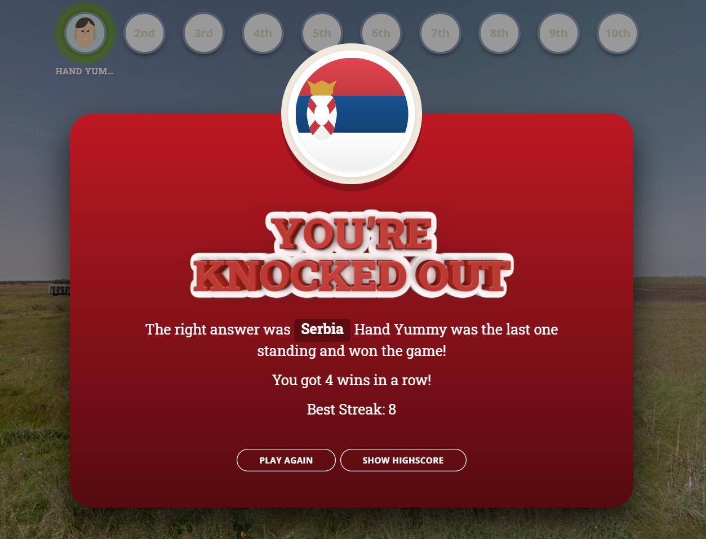
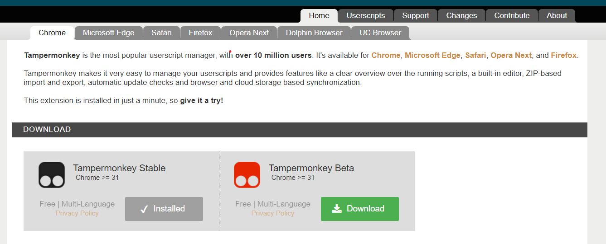
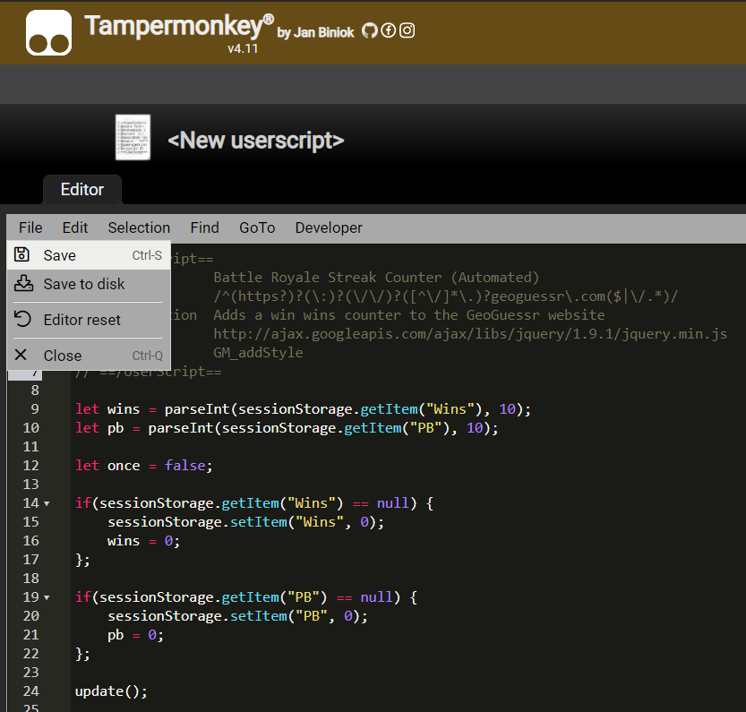

# Battle Royale Streak Counter
Tampermonkey script for GeoGuessr that incorporates a win streak counter into the Battle Royale game mode. *Tutorial for how to install further down!*

* Includes a personal best counter lasting the duration of the session.
* Change score manually by pressing 1 and 2. (can be edited at the bottom of the script)
* Reset current streak by pressing 0 and personal best by pressing 9.

Based on SubSymmetry's Country Streak Counter (Manual) script! 

## Screenshots

## Installation
First download the Chrome extension Tampermonkey from their website: https://www.tampermonkey.net/

After installing, click the Tampermonkey icon up in the right hand corner and choose "Create a new script..." 

Delete the default script and copy & paste the Battle Royale Streak Counter (Automated) script into the editing field. Then click file then save and you're done!! Log on to GeoGuessr and have fun!

