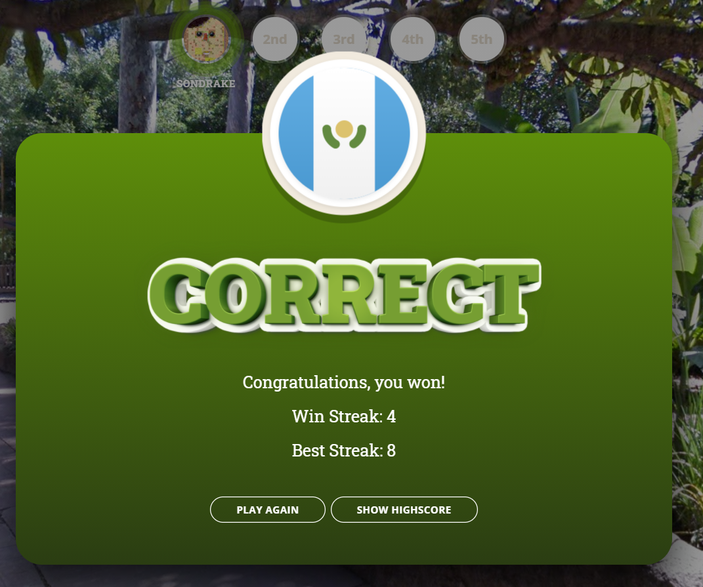
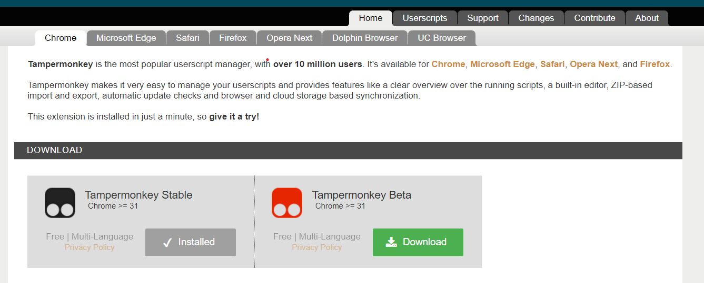
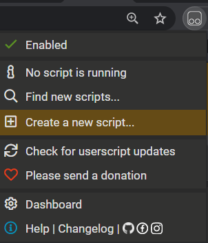
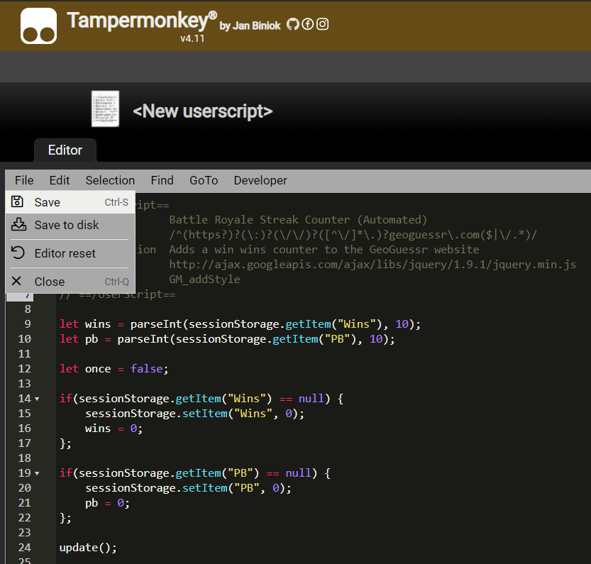
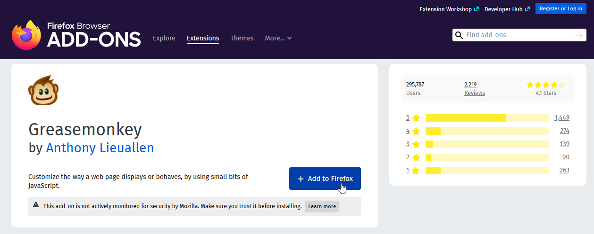
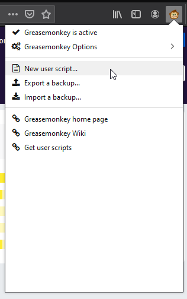
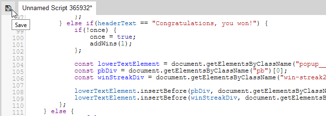

# Battle Royale Streak Counter
Script for GeoGuessr that incorporates a win streak counter into the Battle Royale game mode. *Tutorial for how to install further down!*

* Includes a personal best counter lasting the duration of the session.
* Change score manually by pressing 1 and 2. (can be edited at the bottom of the script)
* Reset current streak by pressing 0 and personal best by pressing 9.

Based on SubSymmetry's Country Streak Counter (Manual) script! 

## Screenshots

## Installation (Chrome)
First download the Chrome extension [Tampermonkey](https://www.tampermonkey.net/) from their website. 

After installing, click the Tampermonkey icon up in the right hand corner and choose "Create a new script..." 

Delete the default script and copy & paste the [Battle Royale Streak Counter (Automated) script](https://raw.githubusercontent.com/Sondrake/Battle-Royale-Streak-Counter/main/battle_royale_streak_counter_(automated).js) into the editing field. Then click file then save and you're done!! Log on to GeoGuessr and have fun!

## Installation (Firefox)
First download the Firefox extension [Greasemonkey](https://addons.mozilla.org/fr/firefox/addon/greasemonkey/) (it should work with any *monkey extension, if you already have one)

After installing, click the Greasemonkey icon up in the right hand corner and choose "New user script..." 

Delete the default script and copy & paste the [Battle Royale Streak Counter (Automated) script](https://raw.githubusercontent.com/Sondrake/Battle-Royale-Streak-Counter/main/battle_royale_streak_counter_(automated).js) into the editing field. Then click the save icon and you're done ! Log on to GeoGuessr and have fun!

